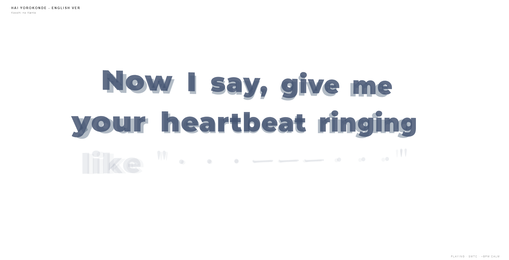

# CotoLyrics

A passive, Cotodama-style desktop **lyric speaker**. It quietly watches whatever
music is playing on your PC, pulls the time-synced lyrics, and renders them as
**word-by-word kinetic typography** in Three.js — with the motion intensity locked
to the song's tempo.

No browser extension, no manual song entry, no login. Press play in your music
app and CotoLyrics does the rest.



> *Live capture — "HAI YOROKONDE (English Ver)" by Kocchi no Kento, mid-line word reveal.*

- **Auto-detects now-playing music** via Windows **SMTC** (System Media Transport
  Controls) — works with Spotify, Apple Music, and any browser/app that reports
  media info to Windows.
- **Synced lyrics** from [LRCLIB](https://lrclib.net) (with a NetEase fallback).
- **Beat-aware animation:** the tempo is resolved per track and locked to one of
  three motion profiles (calm → groovy → intense).
- **Live audio analysis** of system loopback drives the beat/energy reactions.
- **(Optional) BPM detection & animation**, BPM data powered by GetSongBPM

---

## Requirements

- **Windows 10/11** — detection relies on Windows SMTC, so this is Windows-only.
- **[Node.js](https://nodejs.org) 18 or newer** (includes `npm`).
- A music app that reports to Windows "now playing" (Spotify desktop, Apple Music,
  Edge/Chrome playing YouTube, etc.).

## Install & run

```bash
git clone https://github.com/ElicoftZ/CotoLyrics-alpha.git
cd CotoLyrics-alpha
npm install
npm start
```

That's it. A white window titled **CotoLyrics** opens and shows
*"Listening…"* until you start playing music.

## How to use

1. Launch the app with `npm start`.
2. **Play a song** in Spotify / Apple Music / your browser.
3. CotoLyrics detects the track, fetches its synced lyrics, and animates them
   line by line, word by word, in time with the vocal.
4. Switch tracks freely — it re-detects and re-syncs automatically.

If a song has **no synced lyrics** available, the screen stays on the instrumental
visualizer instead of showing text.

### Keyboard shortcuts

| Key | Action |
|-----|--------|
| `[` | Nudge lyrics **earlier** by 25 ms (if they're running late) |
| `]` | Nudge lyrics **later** by 25 ms (if they're running early) |
| `R` | Re-fetch lyrics for the current track |

The lyric offset is shown briefly in the status bar each time you adjust it.

## Motion tiers (BPM → animation)

The detected tempo picks the animation profile for the whole track:

| Tempo | Profile | Feel |
|-------|---------|------|
| **< 100 BPM** | Calm | Gentle fluid drift, slow fades |
| **100–140 BPM** | Groovy | Rhythmic scaling, smooth camera sweeps |
| **> 140 BPM** | Intense | Aggressive entrances, shaking, chaotic vibration |

## Configuration

All knobs live at the top of [`main.js`](main.js) (backend tempo lookup) and inside
[`index.html`](index.html) (renderer). You don't need any of these to use the app —
they're for tuning.

### Pin a song's BPM (instant, offline)

Add an entry to `BPM_DICTIONARY` in [`main.js`](main.js) so a track locks its tempo
instantly with zero network calls:

```js
const BPM_DICTIONARY = {
  "your song title|artist name": 128,
};
```

Keys are lowercase `title|artist`; the app sanitizes incoming metadata (strips
`(Remix)`, `- Remastered`, etc.) before matching.

### Optional online BPM lookup (GetSongBPM)

For songs not in your dictionary, the app can optionally look up the tempo over the
network. Get a free API key from [getsongbpm.com](https://getsongbpm.com/api). The key
is read from the environment **only** so it is never committed — set it either as a real
environment variable, or in a gitignored `.env` file at the project root (read at
startup by `main.js`; preferred for `npm start`):

```bash
# .env (gitignored — never commit)
GETSONGBPM_KEY=your_api_key_here
```

```bash
set GETSONGBPM_KEY=your_api_key_here      # or, Windows (cmd)
$env:GETSONGBPM_KEY="your_api_key_here"   # or, Windows (PowerShell)
```

> **Cloudflare note.** `api.getsongbpm.com` sits behind a Cloudflare *managed
> challenge*. Plain HTTP clients (`fetch`/`curl`) are hard-blocked (403), so the app
> clears the challenge in a hidden Chromium window (~15 s the first time, then cached).
> Cloudflare can still escalate to a loop under repeated lookups; the app backs off
> automatically and falls back to the live `dspBpm` estimate, so playback never stalls.
> A packaged build does **not** bundle `.env` (the key must not ship) — set a real
> environment variable for packaged use.

With no key set, the app falls back to estimating tempo live from the audio.

### Hand-authored lyric timing (optional)

For perfect, vocal-matched timing on a specific track, add an entry to
`LOCAL_LYRICS` in [`index.html`](index.html) — each word gets its own absolute
timestamp (seconds):

```js
const LOCAL_LYRICS = {
  "your song title|artist name": {
    lines: [
      { words: [{ text: "First", time: 0.0 }, { text: "word", time: 0.65 }] },
    ],
  },
};
```

When present, this overrides the online lyric fetch for that track.

## Building a standalone app

```bash
npm run dist:portable   # single portable Windows .exe (dist/)
# or
npm run build           # full electron-builder output
```

## How it works

- **`main.js`** — Electron main process. Serves the renderer over a custom `app://`
  scheme, spawns the SMTC bridge, runs the multi-layer BPM waterfall
  (dictionary → GetSongBPM → live estimate), and grants system-audio loopback.
- **`smtc-bridge.ps1`** — reads Windows "now playing" via WinRT and streams it to
  the app as JSON.
- **`preload.js`** — the secure IPC bridge between main and renderer.
- **`index.html`** — the Three.js renderer: glyph layout, the word-level timeline
  reveal engine, the BPM-locked motion profiles, and the live audio DSP.
- **`mood-engine.js`** — maps lyric/audio mood to motion parameters.

## Troubleshooting

- **Stuck on "Listening…"** — make sure music is actually playing and your player
  shows up in the Windows volume/media flyout. Browser tabs must be actively
  playing audio to register with SMTC.
- **Lyrics out of sync** — nudge with `[` / `]`. Different players report their
  playback position with different lag.
- **No lyrics appear** — that track may not have synced lyrics on LRCLIB; the
  instrumental visualizer runs instead.

## License

[GNU GPL v3.0 or later](LICENSE) — see the [`LICENSE`](LICENSE) file for the full text.
